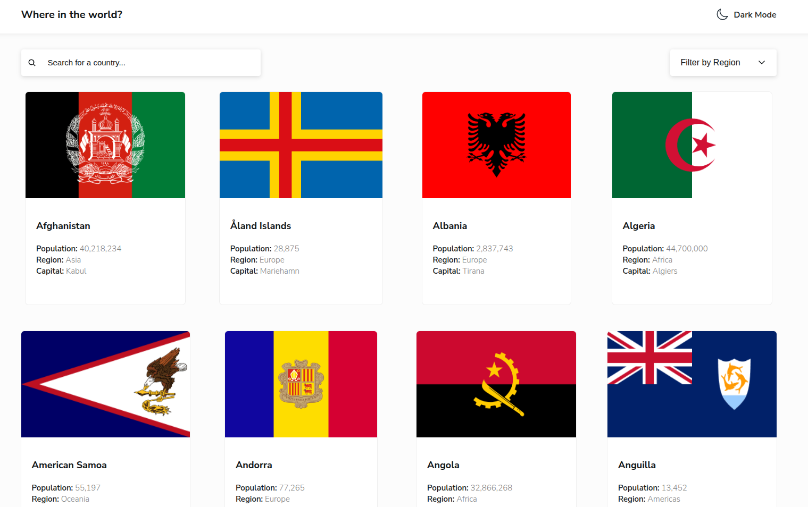

# Frontend Mentor - REST Countries API with color theme switcher solution

This is a solution to the [REST Countries API with color theme switcher challenge on Frontend Mentor](https://www.frontendmentor.io/challenges/rest-countries-api-with-color-theme-switcher-5cacc469fec04111f7b848ca). Frontend Mentor challenges help you improve your coding skills by building realistic projects.

## Table of contents

- [Overview](#overview)
  - [The challenge](#the-challenge)
  - [Screenshot](#screenshot)
  - [Links](#links)
- [My process](#my-process)
  - [Built with](#built-with)
  - [What I learned](#what-i-learned)
  - [Continued development](#continued-development)
  - [Useful resources](#useful-resources)
- [Author](#author)

## Overview

### The challenge

Users should be able to:

- See all countries from the API on the homepage
- Search for a country using an `input` field
- Filter countries by region
- Click on a country to see more detailed information on a separate page
- Click through to the border countries on the detail page
- Toggle the color scheme between light and dark mode _(optional)_

### Screenshot



### Links

- [Solution URL](https://your-solution-url.com)
- [Live Site URL](https://rest-countries-api-omega-flame.vercel.app/NER)

## My process

### Built with

- Semantic HTML5 markup
- CSS custom properties
- CSS modules
- Flexbox
- CSS Grid
- Mobile-first workflow
- [React](https://reactjs.org/) - JS library
- [Vite](https://vite.dev/) - React framework

### What I learned

What i really learn't from this project was the use of the useMemo and memo react hooks in preventing unnecessary component and expensive re-renders by react and it actually helped me a lot, found out my text input wasn't that responsive on each stroke which was as a result of expensive renders from the countries and loading data

To see how you can add code snippets, see below:

```js
// the use Effect function used in fetching the countries from the public folder
import { useState, useEffect } from "react";

export default function useFetch() {
  const [countries, setCountries] = useState([]);
  const [isLoading, setIsLoading] = useState(false);

  useEffect(() => {
    async function fetchCountries() {
      try {
        setIsLoading(true);
        const response = await fetch("/data.json");
        if (!response.ok)
          throw new Error("Something went wrong, failed to fetch");

        const data = await response.json();

        setCountries(data);
      } catch (error) {
        console.log(error);
      } finally {
        setIsLoading(false);
      }
    }
    fetchCountries();
  }, []);

  return { isLoading, countries };
}
```

```js
// the useTheme hook used switch between lightmode and dark mode
import { useEffect, useState } from "react";

export function useTheme() {
  const [theme, setTheme] = useState(() => {
    return localStorage.getItem("theme") || "light";
  });

  useEffect(() => {
    document.documentElement.setAttribute("data-theme", theme);
    localStorage.setItem("theme", theme);
  }, [theme]);

  const toggleTheme = () =>
    setTheme((prev) => (prev === "light" ? "dark" : "light"));

  return { theme, toggleTheme };
}
```

If you want more help with writing markdown, we'd recommend checking out [The Markdown Guide](https://www.markdownguide.org/) to learn more.

**Note: Delete this note and the content within this section and replace with your own learnings.**

### Continued development

in the future, the areas i will be focusing on is on the map aspect where when one clicks on a particular country details and option will also be provided to view the country on a map by getting the map coordinates

## Author

- github - [Dr.slopes](https://github.com/Drslope-99)
- Frontend Mentor - [@Drslope-99](https://www.frontendmentor.io/profile/Drslope-99)
- Twitter - [@ukangaofficial](https://x.com/ukangaofficial?t=qlkINpYpouPxXZZ61RKXhw&s=09)
